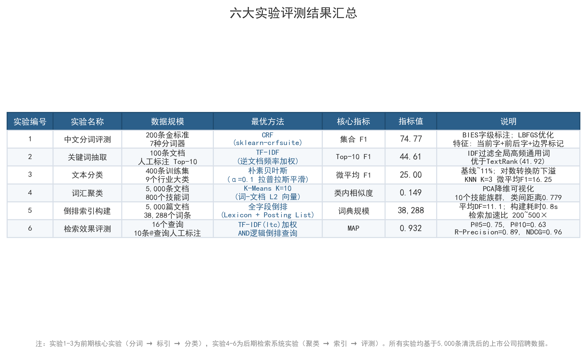

# 上市公司招聘信息检索系统

> 面向中文招聘信息的垂直搜索与文本分析系统，覆盖数据清洗、中文分词、倒排索引、TF-IDF 排序、分类聚类、检索评测和 Web 可视化的完整流程。

[](https://www.python.org/)
[](https://flask.palletsprojects.com/)
[](https://scikit-learn.org/)

## 项目简介

这是一个“信息检索系统设计与开发”课程小组项目。项目以中国 A 股上市公司招聘数据为语料，原始数据约 9.3 万条，经清洗、标准化和抽样后选取 5,000 条招聘记录构建检索系统。

系统既支持岗位关键词搜索，也支持行业、城市、学历、经验和薪资等结构化条件筛选。检索过程使用自建倒排索引缩小候选范围，再通过 TF-IDF 向量空间模型计算相关性，并结合岗位标题加权完成排序。除了搜索功能，项目还包含中文分词对比、关键词抽取、行业分类、词汇聚类、相似岗位推荐和离线评测。

## 核心功能

- **全文检索**：对岗位名称和职位描述进行中文关键词检索。
- **多条件筛选**：支持行业、城市、学历、工作经验和薪资范围组合过滤。
- **相关性排序**：基于 TF-IDF 与余弦相似度计算得分，岗位标题命中给予 2 倍权重。
- **关键词高亮**：在标题和职位描述片段中突出查询词，便于快速判断结果相关性。
- **职位详情与推荐**：展示岗位完整信息、关键词标签及 Top-5 相似职位。
- **分类与聚类**：使用朴素贝叶斯进行行业分类，通过 K-Means 和层次聚类分析技能词群。
- **数据可视化**：展示行业、城市、学历、经验和薪资分布，以及聚类和地图视图。
- **REST API**：提供搜索、职位详情、行业、城市、统计和地图数据接口。

## 系统流程

```text
原始招聘数据（约 93,000 条）
        │
        ▼
文本清洗与字段标准化
        │
        ▼
系统语料（5,000 条，14 个字段）
        │
        ├── 中文分词与停用词过滤
        ├── 倒排索引构建
        ├── TF-IDF 文档向量
        ├── 关键词抽取与行业分类
        └── 词汇聚类与相似职位计算
        │
        ▼
Flask Web 应用
        │
        ├── 关键词查询 ──► 倒排索引召回 ──► VSM 相关性排序
        ├── 行业/城市/学历/经验/薪资过滤
        └── 结果高亮、职位详情、相似推荐与统计可视化
```

## 技术实现

| 模块 | 实现方式 |
| --- | --- |
| 数据处理 | Pandas、NumPy、正则清洗、字段标准化 |
| 中文分词 | Jieba 在线分词；FMM、BMM、BiMM、最少切分、HMM、N-gram、CRF 离线对比 |
| 文档召回 | 基于 Python `dict` 与 Posting List 自建倒排索引 |
| 相关性排序 | TF-IDF、向量空间模型（VSM）、余弦相似度、标题权重与企业名加分 |
| 关键词抽取 | TF-IDF 与 TextRank 对比实验 |
| 文本分类 | KNN 与朴素贝叶斯对比，选择 NB 作为最终模型 |
| 聚类分析 | K-Means、层次聚类、PCA 降维可视化 |
| Web 应用 | Flask、Jinja2、HTML、CSS、JavaScript、ECharts |
| 模型存储 | SciPy 稀疏矩阵、Pickle、Joblib、JSON |

## 实验与评测

项目采用人工标注查询结果进行检索评测，同时保留了分词、关键词、分类和聚类阶段的离线实验结果。

### 检索效果

| 指标 | 结果 |
| --- | ---: |
| 评测查询数 | 16 |
| 平均 P@5 | 0.7500 |
| 平均 P@10 | 0.6312 |
| R-Precision | 0.8869 |
| MAP | 0.9322 |
| NDCG@10 | 0.9611 |

### 分词与分类

- 7 种分词方法中，CRF 的 F1 为 **74.77%**，N-gram 的 F1 为 **73.43%**。
- 400 条人工分类样本、9 个类别的实验中，朴素贝叶斯 Micro-F1 为 **25.00%**，优于 KNN 的 **16.25%**。
- 分类训练样本规模较小，因此分类结果主要用于课程实验和方法对比，不代表生产环境效果。



## 快速开始

### 1. 克隆项目

```bash
git clone https://github.com/XDforever-lab/job-info-retrieval-system.git
cd job-info-retrieval-system/code
```

仓库包含实验数据和预训练模型，体积较大，首次克隆可能需要一些时间。

### 2. 创建虚拟环境

```bash
python -m venv .venv
```

Windows PowerShell：

```powershell
.venv\Scripts\Activate.ps1
```

macOS / Linux：

```bash
source .venv/bin/activate
```

### 3. 安装依赖

```bash
python -m pip install --upgrade pip
pip install -r requirements.txt
```

### 4. 启动系统

```bash
python frontend/app.py
```

浏览器访问：<http://127.0.0.1:5000>

应用启动时会将 5,000 条招聘记录、倒排索引和 TF-IDF 矩阵加载到内存，首次启动需要等待片刻。

## API 示例

```http
GET /api/search?q=Python%20开发&city=上海&page=1
GET /api/job/34
GET /api/industries
GET /api/cities
GET /api/stats
GET /api/map_data
```

搜索接口支持的主要参数：

| 参数 | 说明 |
| --- | --- |
| `q` | 查询关键词 |
| `industry` | 行业筛选 |
| `city` | 城市筛选 |
| `education` | 学历要求 |
| `experience` | 工作经验 |
| `salary_min` / `salary_max` | 薪资范围 |
| `sort_by` | 相关性、薪资或日期排序 |
| `page` | 页码 |

## 项目结构

```text
code/
├── config.py                  # 路径、模型和检索参数配置
├── requirements.txt           # Python 依赖
├── frontend/
│   ├── app.py                 # Flask 应用入口与 API
│   ├── templates/             # Jinja2 页面模板
│   └── static/                # CSS、JavaScript 与前端数据
├── src/
│   ├── common/                # 数据加载等公共模块
│   ├── pre_midterm/           # 清洗、分词、关键词、分类和聚类实验
│   └── post_midterm/          # 索引、检索、预测、高亮和评测模块
├── models/                    # 倒排索引、TF-IDF 矩阵与分类模型
├── output/                    # 清洗语料、实验报告、图表和中间结果
└── docs/                      # 实验报告材料
```

## 设计取舍

- **倒排索引 + VSM**：倒排索引用于快速召回，TF-IDF 向量用于相关性排序，两者分别解决效率与排序质量问题。
- **标题加权**：在招聘场景中，岗位名称通常比正文中的偶然命中更能反映相关性，因此对标题命中设置 2 倍权重。
- **在线 Jieba，离线 CRF**：短查询使用 Jieba 以降低启动和响应开销；CRF 用于离线分词实验和高质量语料处理。
- **服务端渲染**：数据规模为 5,000 条，使用 Flask + Jinja2 可以保持结构简单，并满足课程展示和功能验证需求。
- **预计算产物**：关键词、相似职位、索引和向量矩阵提前计算，减少 Web 请求阶段的计算量。

## 当前局限与改进方向

- 行业分类仅使用 400 条人工标注样本，后续可扩充训练集并尝试预训练语言模型。
- 当前检索主要基于词项匹配，对同义词、语义改写和长文本查询的理解能力有限。
- 索引和数据在启动时一次性载入内存，适合课程规模数据；更大规模场景可迁移到 Elasticsearch 或向量数据库。
- 可进一步补充自动化测试、Docker 部署、用户登录、收藏和职位对比功能。

## 数据与使用说明

本仓库用于课程学习、技术交流和个人作品展示。招聘数据仅用于信息检索实验，请勿将数据或系统输出用于商业用途；使用数据时应遵守其原始来源的授权与隐私要求。

项目目前未附带开源许可证。在许可证补充前，仓库公开仅表示代码可查看，不代表自动授予复制、修改或商业使用权。

## 项目背景

该项目覆盖了一套信息检索系统从语料处理到产品展示的完整链路，重点实践了：

- 中文文本预处理与人工标注规范；
- 倒排索引和向量空间检索的工程实现；
- 分词、关键词、分类、聚类和检索效果的实验设计；
- Flask Web 系统集成与数据可视化；
- 使用 P@K、R-Precision、MAP、NDCG 和 11 点 P/R 曲线评价检索质量。

